# PI 2° Semestre - Animalist (Plataforma Social de Animes)

Este projeto é o PI (Projeto Interdisciplinar) do 2º semestre do curso de DSM (Desenvolvimento de Software Multiplataforma) da Fatec Franca Dr. Thomaz Novelino. O objetivo é evoluir o conhecimento adquirido no primeiro semestre, agora criando uma aplicação web completa e funcional, com backend, banco de dados e recursos interativos, focada no universo de animes.

## 📄 Descrição

O sistema foi desenvolvido utilizando **React** (Vite) no frontend, com componentes reutilizáveis, design responsivo e experiência de usuário moderna. O backend (Node.js/Express) e o banco de dados (MySQL) garantem persistência e autenticação segura.

## 📱 Funcionalidades Principais

### Para Usuários:
- ✅ Cadastro e login seguro
- ✅ Explorar catálogo de animações
- ✅ Avaliar com nota e comentário
- ✅ Organizar listas pessoais
- ✅ Busca avançada por título/gênero
- ✅ Perfil personalizado (Em Breve)
- ✅ Sistema de filtros avançados
- ✅ Interface responsiva e moderna

### Para Administradores:
- ✅ Gerenciar animações (CRUD)
- ✅ Moderar comentários (Em breve)
- ✅ Gerenciar gêneros 
- ✅ Dashboard administrativo
- ✅ Estatísticas da plataforma (Em Breve)

## 🚀 Tecnologias Utilizadas

### Backend
- **Node.js** com Express.js
- **MySQL** como banco de dados relacional
- **JWT** para autenticação
- **Bcrypt** para criptografia de senhas
- **Joi** para validação de dados
- **Helmet** e **CORS** para segurança

### Frontend
- **React 18** com Vite
- **Tailwind CSS** para estilização
- **shadcn/ui** para componentes
- **React Router** para navegação
- **Axios** para requisições HTTP
- **Lucide React** para ícones

---

O Animalist é um projeto acadêmico, mas busca entregar uma experiência real de rede social temática, incentivando a organização, avaliação e descoberta de novas animações entre os usuários.

## 📋 Pré-requisitos

- Node.js (versão 18 ou superior)
- MySQL (versão 8 ou superior)
- npm ou yarn

## 🛠️ Instalação e Configuração

### 1. Clone o repositório
No terminal:

"git clone https://github.com/input-name-Guilherme-araujo/Pi-2-semestre---DSM.git"

"cd nomerepositorio"

### 2. Configuração do Banco de Dados

#### Instale o MySQL e crie o banco:
No banco:

"CREATE DATABASE animalist;"
                   

#### Execute o script de criação das tabelas:
No terminal:

"mysql -u root -p animalist < database/schema.sql"

### 3. Configuração do Backend

#### Navegue para a pasta do backend:
No terminal:

 "cd backend"

#### Instale as dependências:
No terminal:

"npm install" ou "npm i"

#### Configure as variáveis de ambiente:
Crie o .env do backend utilizando a estrutura do .env.example

#### Edite o arquivo `.env` com suas configurações:
No arquivio .env do Backend:

NODE_ENV=development
PORT=5000
DB_HOST=localhost
DB_USER=root
DB_PASSWORD=sua_senha_mysql
DB_NAME=animalist
JWT_SECRET=seu_jwt_secret_super_seguro
JWT_EXPIRES_IN=7d
BCRYPT_ROUNDS=12
\`\`\`

#### Popule o banco com dados de exemplo:
No terminal:

"npm run seed"

#### Inicie o servidor backend:
no terminal:

# Desenvolvimento
"npm run dev"

### 4. Configuração do Frontend

#### Em um novo terminal, navegue para a pasta do frontend:
No terminal:

"cd frontend"

#### Instale as dependências:
No terminal:

"npm install" ou "npm i"

#### Configure as variáveis de ambiente (opcional):
Arquivo .env.local no Frontend

#### Inicie o servidor frontend:
No terminal:

"npm run dev"

## 🗄️ Estrutura do Banco de Dados

### Principais Tabelas:
- **usuarios**: Dados dos usuários e autenticação
- **roles**: Tipos de usuário (admin/user)
- **animacoes**: Informações das animações
- **generos**: Categorias das animações
- **animacao_generos**: Relacionamento many-to-many
- **avaliacoes**: Reviews e notas dos usuários
- **lista_pessoal**: Listas personalizadas (assistido/desejado)
- **comentarios**: Sistema de comentários

## 🔐 Autenticação e Segurança

- **JWT** para autenticação stateless
- **Bcrypt** com 12 rounds para hash de senhas
- **Helmet** para headers de segurança
- **Rate limiting** para prevenir spam
- **Validação** rigorosa de dados com Joi
- **CORS** configurado adequadamente

## 🎨 Interface e Experiência

- **Design responsivo** para todos os dispositivos
- **Tema escuro/claro** (implementação futura)
- **Componentes reutilizáveis** com shadcn/ui
- **Animações suaves** com Tailwind CSS
- **Carregamento otimizado** com lazy loading

## 🎮 Como Usar

### 1. Acesso Inicial
- Acesse `http://localhost:3000` no navegador
- Crie uma conta ou faça login
- Explore o catálogo de animações

### 2. Avaliando Animações
- Clique em uma animação para ver detalhes
- Dê uma nota de 1 a 5 estrelas
- Escreva um comentário (opcional)
- Adicione à sua lista pessoal

### 3. Organizando sua Lista
- Acesse "Minha Lista" no menu
- Organize por status: assistido, desejado, assistindo, etc.
- Filtre e busque suas animações

### 4. Administração (apenas admins)
- Acesse o dashboard administrativo
- Gerencie animações
- Modere comentários (Em Breve)

## 🧪 Dados de Teste

Após executar `npm run seed`, você terá:

**Usuário Admin:**
- Email: `admin@animalist.com`
- Senha: `admin123`

**Animações de exemplo:**
- Attack on Titan
- Demon Slayer
- Your Name
- One Piece
- Naruto
- Spirited Away
- Death Note
- My Hero Academia

## 🏆 Figma do Projeto
### 🥇 [Alta Fidelidade](https://www.figma.com/proto/RvecKbxlyBm4qnbfiyd9WG/Animalist-PI?node-id=0-1&t=68QxqAidBdEWmAh5-1)

## 📸 Screenshots do Sistema

### 👤 Interface do Usuário

#### Cadastro e Autenticação
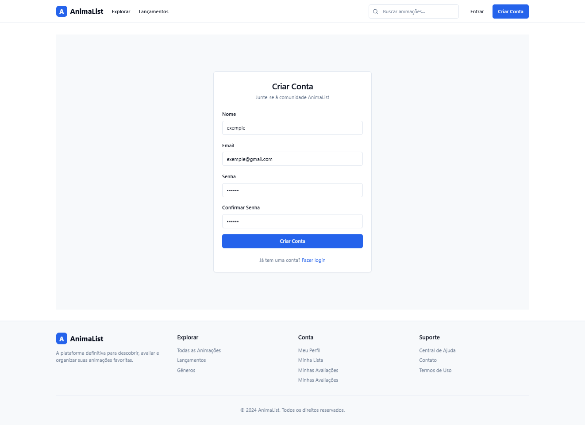

#### Página Inicial
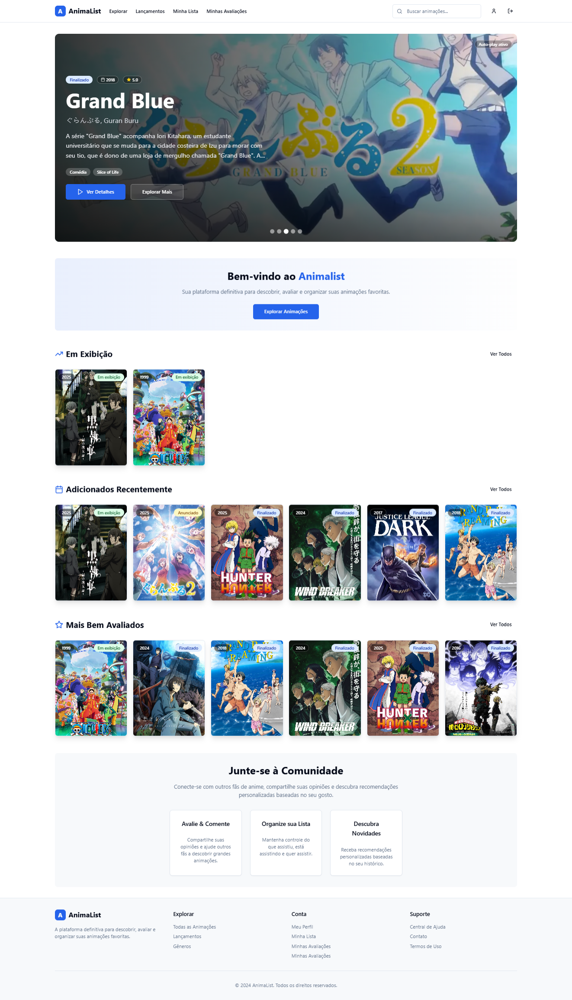

#### Explorar Animações
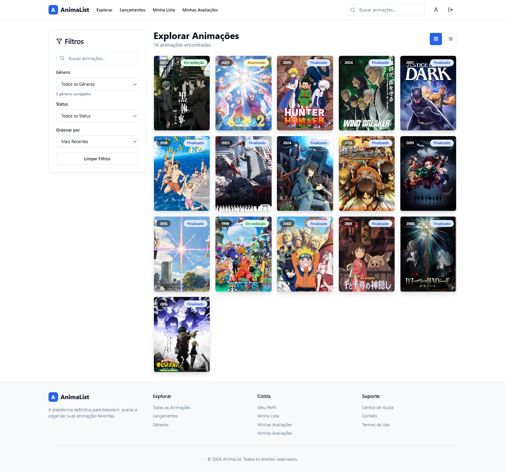

#### Lançamentos Recentes
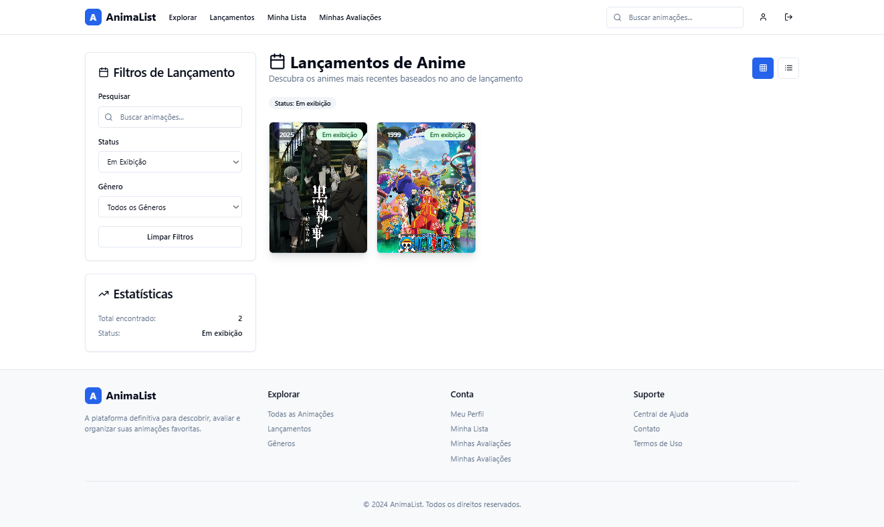

#### Minha Lista Pessoal
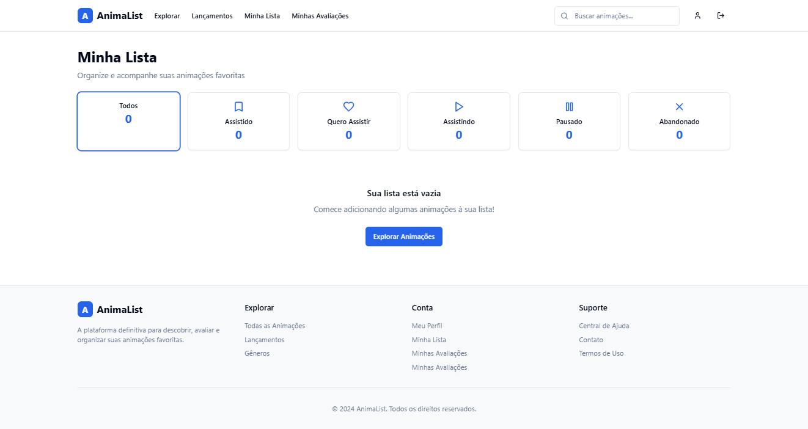

#### Minhas Avaliações
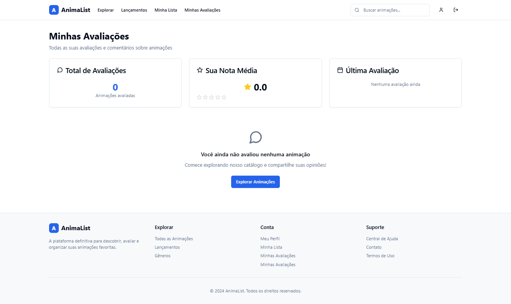

#### Perfil do Usuário
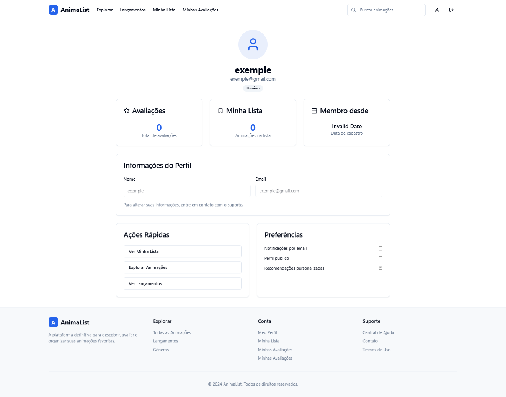

---

### ⚙️ Interface Administrativa

#### Dashboard Administrativo
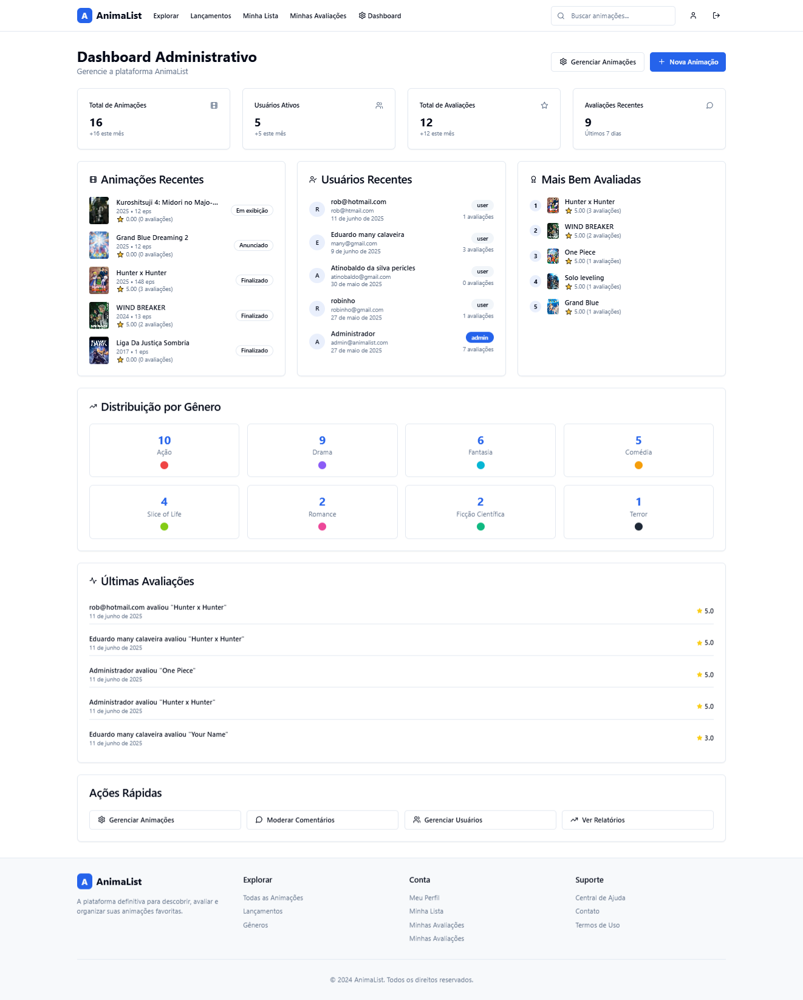

#### Gerenciar Animações
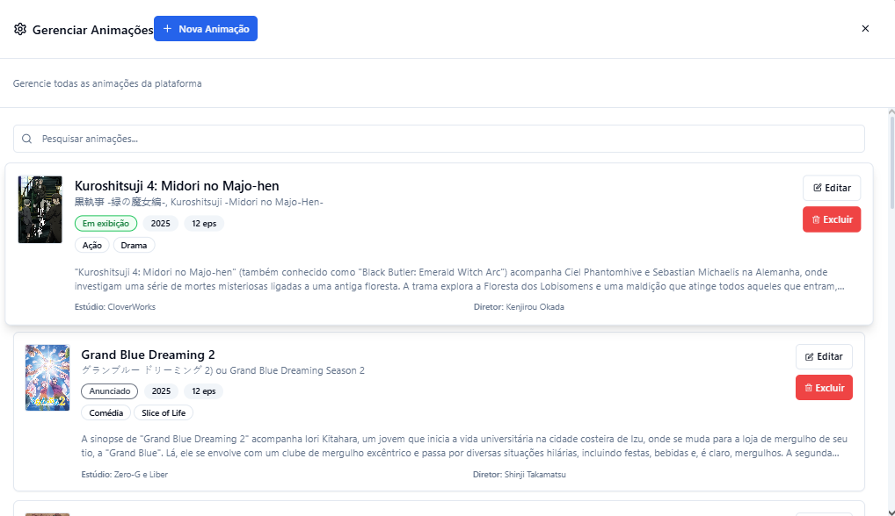

#### Editar Animações
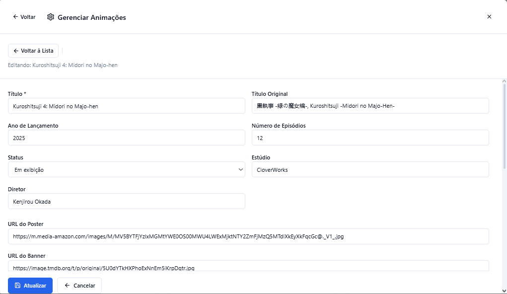

#### Home Admin
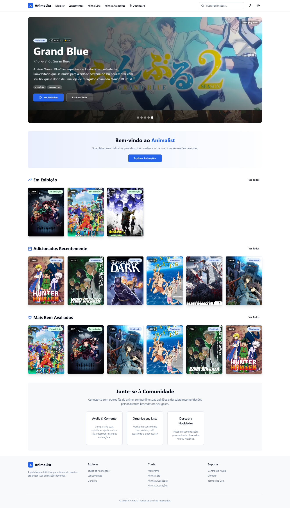

#### Explorar Admin
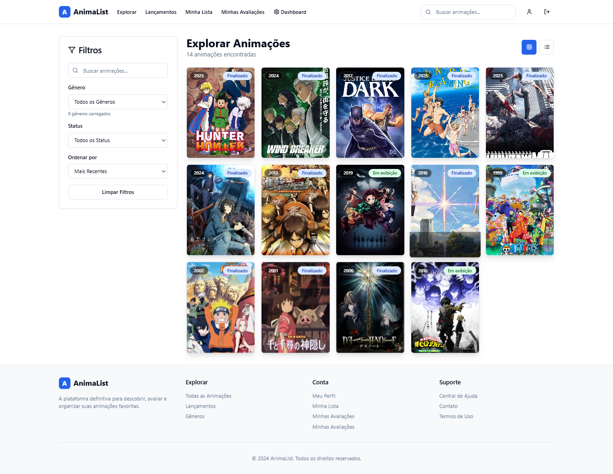

#### Lançamentos Admin
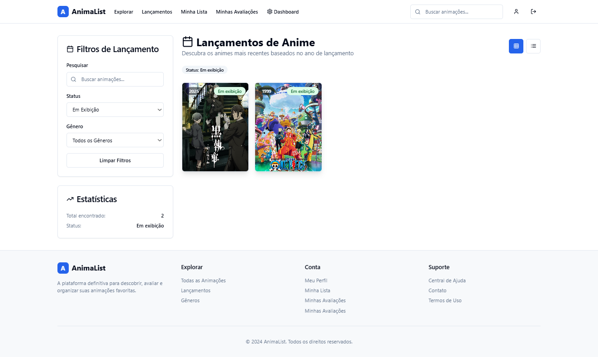

#### Minha Lista Admin
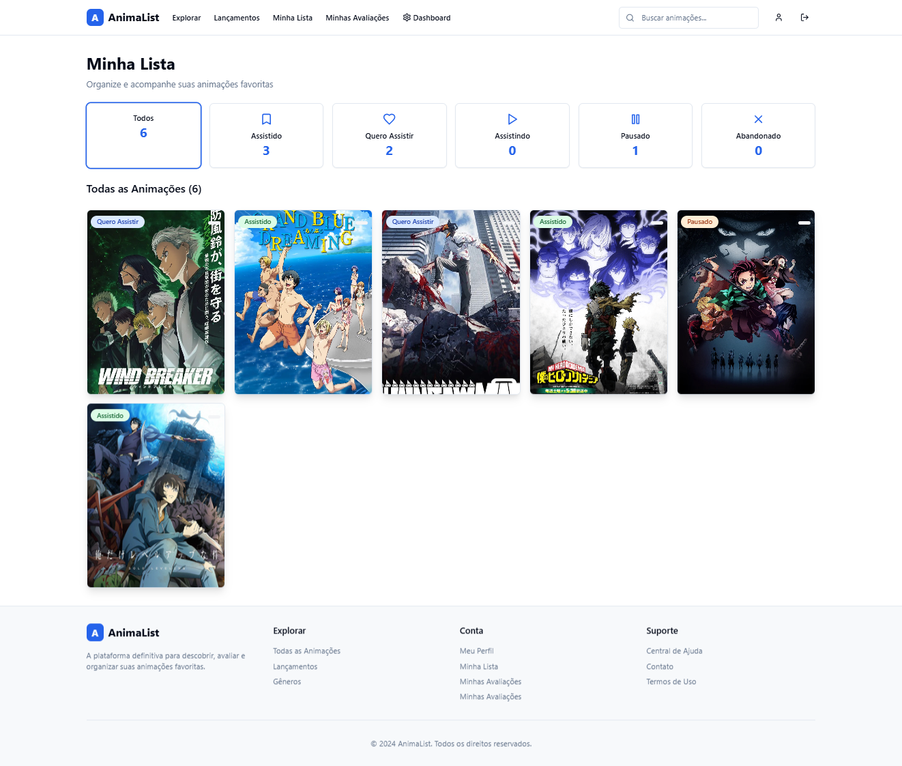

#### Minhas Avaliações Admin
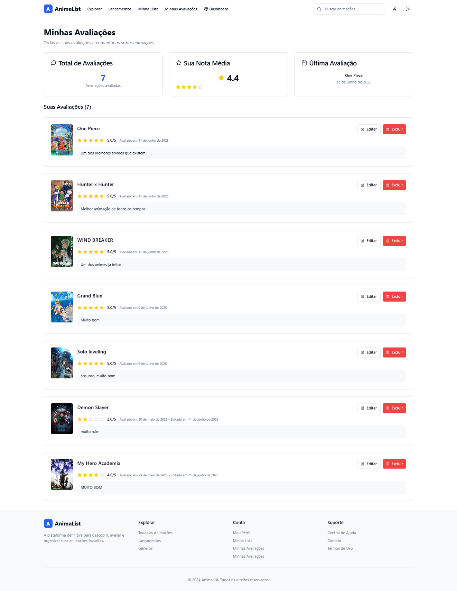

---

## 🎯 Principais Características Visuais

### 🎨 Design System
- **Interface moderna** com componentes shadcn/ui
- **Layout responsivo** adaptável a diferentes telas
- **Cores consistentes** seguindo o tema do projeto
- **Tipografia clara** para melhor legibilidade
- **Ícones intuitivos** da biblioteca Lucide React

### 📱 Experiência do Usuário
- **Navegação intuitiva** entre as seções
- **Filtros avançados** para busca de animações
- **Sistema de avaliação** com estrelas visuais
- **Organização clara** das listas pessoais
- **Feedback visual** para todas as ações

### 🔧 Interface Administrativa
- **Dashboard completo** com estatísticas
- **Gerenciamento eficiente** de conteúdo
- **Formulários validados** para entrada de dados
- **Controles de acesso** diferenciados
- **Relatórios visuais** (em desenvolvimento)

---

## ✒️ Autores
* **[ANDRÉ CORAL RODRIGUES](https://github.com/o0darkness0o)** - *Criação do Figma e Participação na documentação;*
* **[BRUNO JOSÉ RODRIGUES](https://github.com/Bjoota)** - *Participação na Documentação e banco de dados;*
* **[GUILHERME DE ARAUJO SILVA](https://github.com/input-name-Guilherme-araujo)** - *Criação do Front-End/Back-End, Criação do banco de dados e Participção na documentação;*
* **[ESPEDITO DUARTE GONÇALVES MAIA](https://github.com/duarte-maia)** - *Participação Banco de dados e Documentação;*

## 🎉 Agradecimentos

- Comunidade React e Node.js
- Criadores do shadcn/ui
- Agradecemos a todos os professores que nos ministraram o curso durante o segundo semestre, especialmente aos professores que nos ministraram as disciplinas fundamentais para o desenvolvimento desse projeto: 

- **Prof. Jorge** - Engenharia de Software II;
- **Prof. Neto** -  Desenvolvimento Web II
- **Prof. Rodrigo** - Banco de dados (Relacional)
---

**AnimaList** - Desenvolvido com ❤️ para a comunidade de anime

